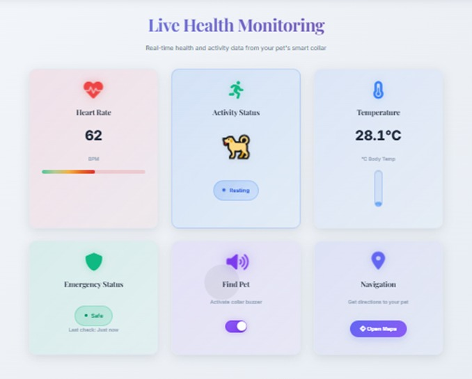
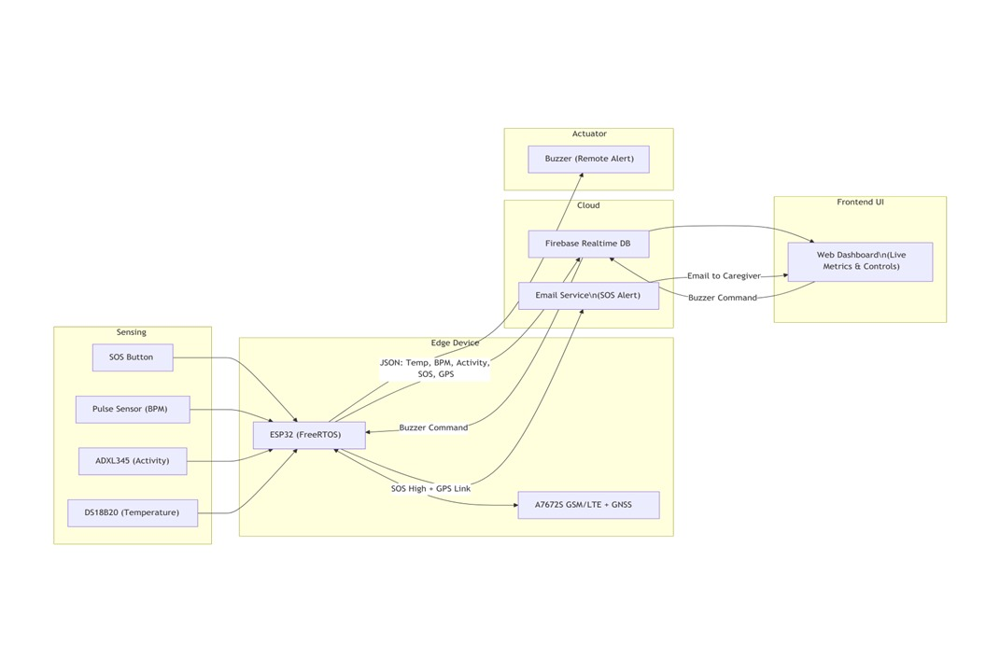
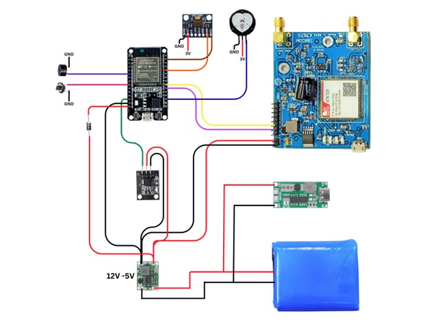
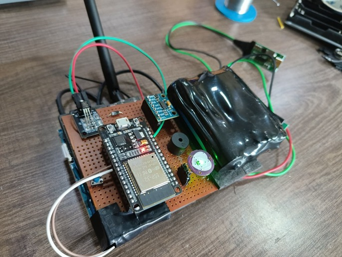
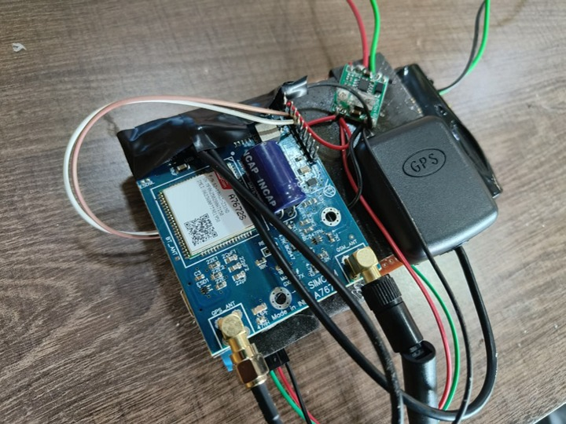
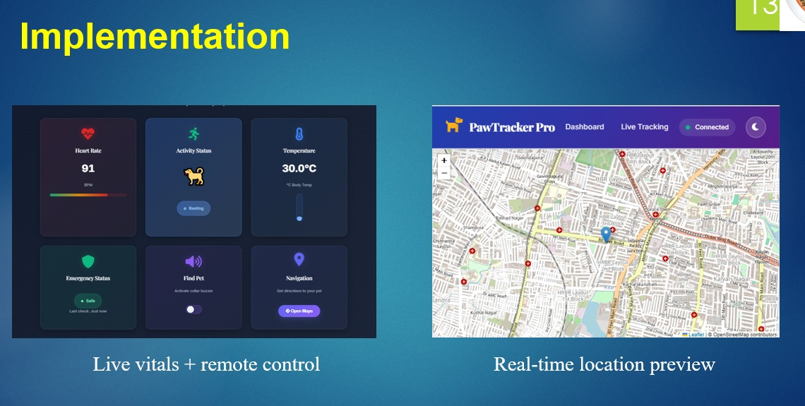
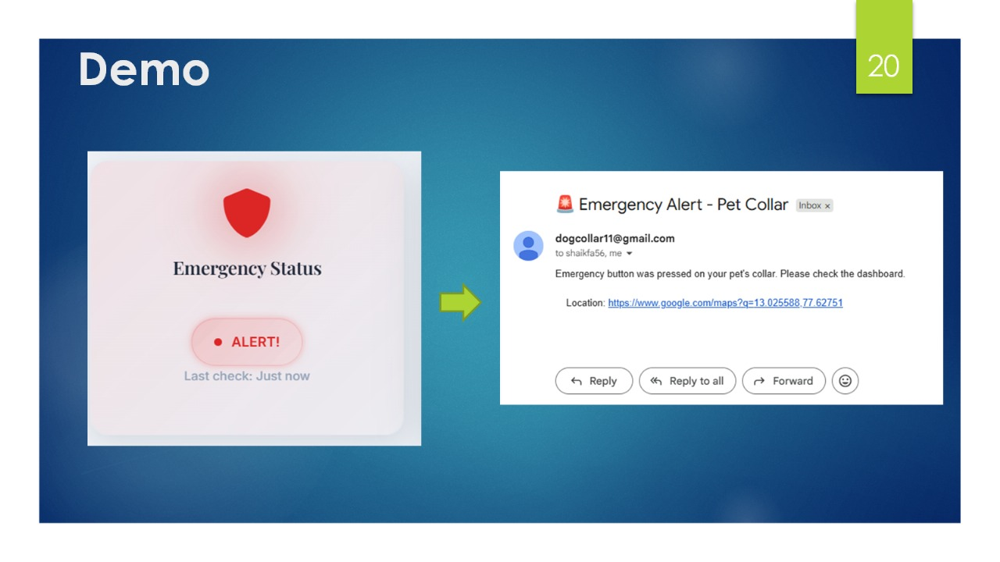
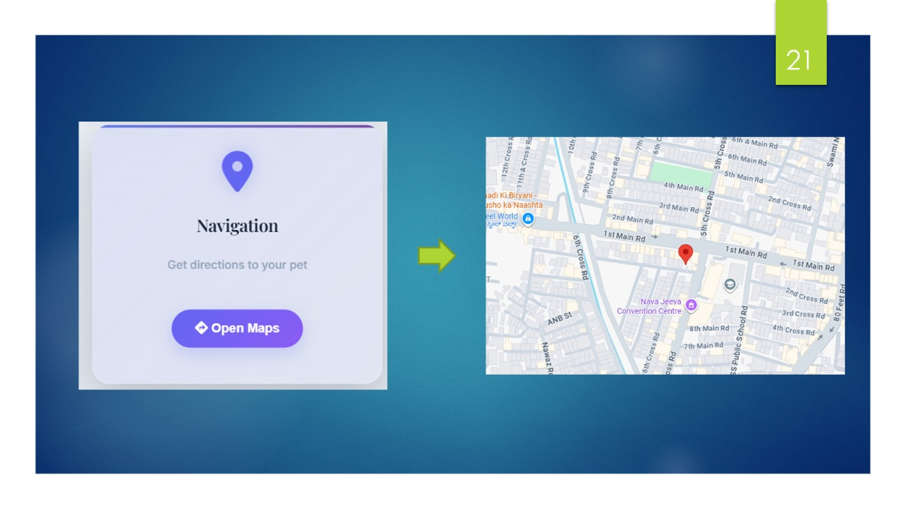

# 🐾 Smart Dog Collar

An IoT-based smart collar designed for real-time monitoring of a dog’s **health, activity, and location** using ESP32, GSM/GPS, and Firebase.  
It enables **24/7 tracking**, **SOS alerts**, and **cloud-based dashboards** for complete pet safety and wellness.

---

## 💡 Features
- **Health Monitoring:** Tracks temperature, heart rate, and activity levels (resting, walking, running)  
- **GPS Tracking:** Provides real-time location using GSM/GNSS  
- **Cloud Connectivity:** Syncs data to Firebase in real time  
- **Emergency Alerts:** Sends email notifications via Flask + SMTP when abnormal readings or SOS events occur  
- **Web Dashboard:** Interactive interface with maps and live vitals  
- **Remote Buzzer:** Enables owners to locate pets through a controlled buzzer  

---

## 🧠 System Architecture
1. Sensors collect body temperature, heart rate, and motion data  
2. ESP32 processes and transmits data to Firebase using Wi-Fi or GSM  
3. Cloud backend triggers alerts through Flask (Python) and SMTP  
4. Owner accesses live data through a responsive web dashboard  

---

## 🧰 Hardware Components
| Component | Purpose |
|------------|----------|
| ESP32 | Main controller |
| DS18B20 | Temperature sensor |
| MAX30102 / Pulse Sensor | Heart rate monitoring |
| ADXL345 / MPU6050 | Activity recognition |
| SIM800L / SIMCom A7672S | GSM + GPS communication |
| SOS Button | Emergency alerts |
| Buzzer | Remote recall alert |
| 3S Li-ion Battery Pack | Power supply |
| MP1584EN Regulator | Voltage regulation |

---

## ⚙️ Software Stack
- **Microcontroller:** ESP32 (Arduino IDE, C++)  
- **Backend:** Firebase Realtime Database + Flask (Python)  
- **Frontend:** HTML, CSS, JavaScript, Leaflet.js (map)  
- **Cloud Services:** Firebase + PythonAnywhere  
- **Email Notifications:** SMTP (Gmail App Password)  

---
---

## 🖼️ Project Implementation & Visuals

### 💻 Dashboard Interface

*Real-time vitals and remote control via web dashboard.*

### 🧠 System Architecture

*End-to-end data flow from sensors to cloud to user interface.*

### ⚙️ Circuit Connection Diagram

*Complete wiring of ESP32, sensors, GSM/GPS, and battery module.*

### 🔧 Hardware Prototype

*Working prototype built on perfboard with ESP32 and GSM/GPS integration.*

### 📊 Implementation Screens

*Live vitals, remote control, and map view for real-time tracking.*

### 🚨 Alert Demo

*Email alert triggered by SOS button press.*

### 🗺️ Navigation Demo

*Google Maps link generation for live pet tracking.*

---

## 🧩 Folder Structure

